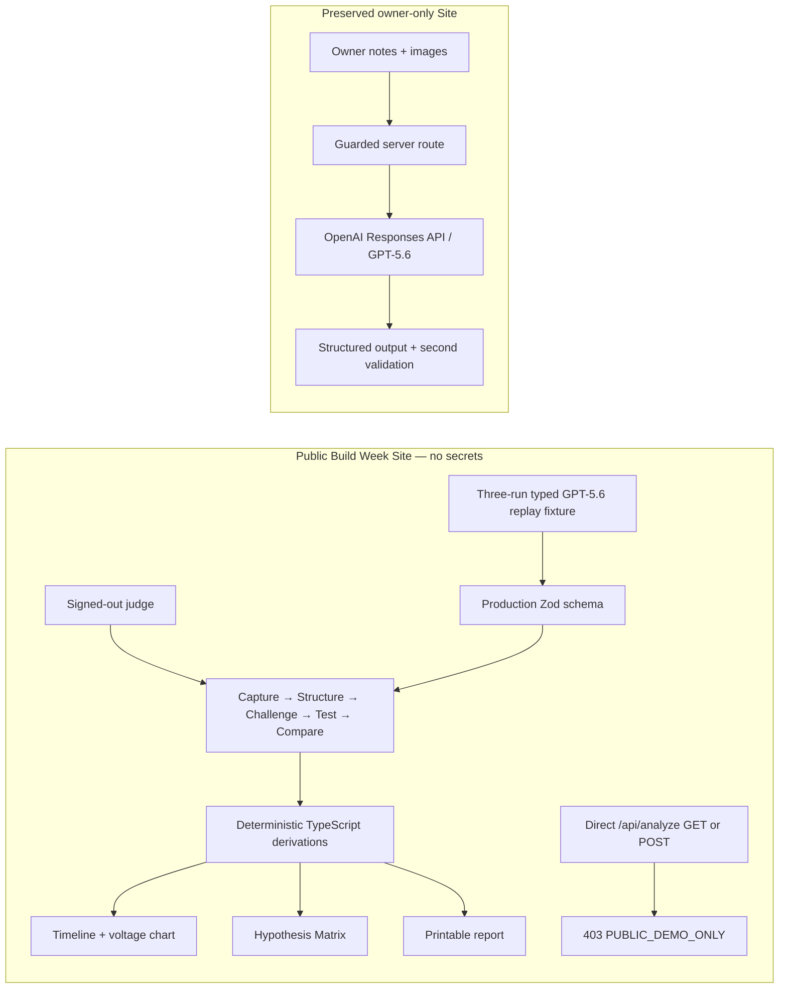
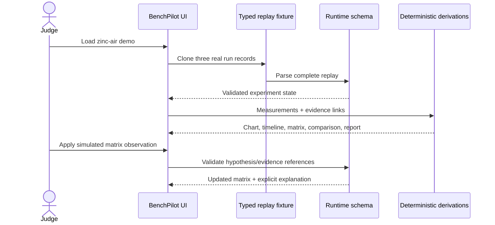

# BenchPilot architecture

## Release topology

The public project has no environment variables, imports no live-analysis service in its route, and cannot trigger paid inference. The already-deployed private project retains the server-only key and genuine multimodal analysis behind owner access.

## Public trust boundaries

1. **Fixture parity:** the deterministic replay is validated by the same production `analysisSchema` and `experimentRunSchema` used for live output.
2. **Server enforcement:** public GET and POST analysis requests return `403 PUBLIC_DEMO_ONLY`; hiding a button is not the security boundary.
3. **No secret surface:** the public Sites project has zero environment variables; source maps are disabled; built artifacts contain no OpenAI endpoint or key marker.
4. **Numerical traceability:** the chart is derived only from validated voltage measurements with recorded elapsed time. It never interpolates or adds model-authored points.
5. **Epistemic traceability:** reported facts, instrument readings, image observations, calculations, hypotheses, unknowns, safety, and recommendations retain distinct labels.
6. **Simulation isolation:** the matched-replicate matrix update is visibly simulated and remains outside observed runs and charts.

## Major modules

| Area                     | Responsibility                                                                                            |
| ------------------------ | --------------------------------------------------------------------------------------------------------- |
| `lib/domain/`            | Strict schemas, measurement ordering, and matrix validation                                               |
| `lib/demo/`              | Latest, rapid-collapse, and delayed-recovery zinc-air records plus the typed replay                       |
| `app/voltage-chart.tsx`  | Deterministic chart tuples and accessible Recharts rendering                                              |
| `app/benchpilot-app.tsx` | Five-stage workflow, provenance UI, replay state, matrix update, comparison, and report                   |
| `app/api/analyze/`       | Public hard-disable boundary with safe, non-secret diagnostics                                            |
| `server/`                | Preserved private live-analysis implementation and versioned evidence-only prompts                        |
| `tests/`                 | Schema, data, chart, matrix, public-route, no-fetch replay, keyboard, report, and rendered-build coverage |

## Public data flow

## Deliberate constraints

The contest release uses browser-local persistence and no D1, R2, authentication, team layer, payment system, or autonomous hardware control. It does not claim the battery mechanism is proven. The public release cannot analyze new visitor uploads; that capability remains isolated in the private owner-only deployment.
