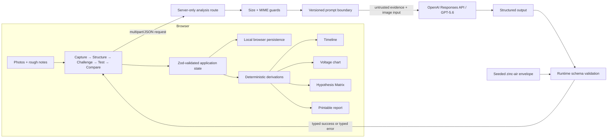
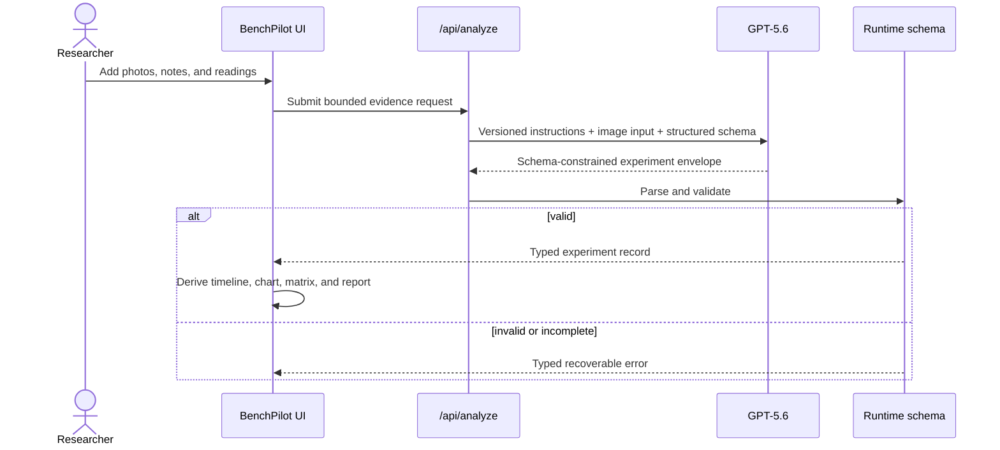

# BenchPilot architecture

## System view

## Trust boundaries

1. **User content is evidence, not instruction.** Notes, filenames, and image content are wrapped as untrusted experiment material. They cannot modify the system goal, schema, or safety policy.
2. **Secrets stay server-side.** Only the analysis route reads `OPENAI_API_KEY`; client code receives a typed response envelope.
3. **Validation is the state boundary.** Live and seeded records must pass the same Zod schema before the UI consumes them. Invalid or incomplete model output returns a recoverable error.
4. **The model does not render numbers.** Timelines, charts, comparisons, and matrix state are derived in TypeScript from validated records and explicit evidence links.
5. **Provenance survives presentation.** Evidence types remain distinct through schema, state, UI labels, and report output.

## Major modules

| Area           | Responsibility                                                                                                         |
| -------------- | ---------------------------------------------------------------------------------------------------------------------- |
| Domain schemas | Experiment records, evidence provenance, hypotheses, planned tests, comparisons, analysis envelope, runtime validation |
| Seed data      | Two zinc-air runs plus precomputed challenges, test plans, and matrix relationships                                    |
| Derivations    | Measurement normalization and sorting, chart series, matrix construction, support deltas                               |
| Workflow UI    | Five-stage navigation, responsive evidence cards, state feedback, report surface                                       |
| Analysis route | Request limits, file checks, abort/error mapping, safe logging, OpenAI SDK call                                        |
| Prompt module  | Versioned system/developer prompts, evidence delimiters, JSON-schema contract                                          |
| Persistence    | Contest-mode records and preferences in `localStorage`; no database                                                    |

## Core data flow

## Deployment shape

The repository targets the bundled Vinext/Vite/Cloudflare Sites runtime. `.openai/hosting.json` declares no D1 or R2 binding because the contest build uses browser persistence and ephemeral image submission. The production artifact is created with `npm run build`; publishing is performed through the configured OpenAI Sites workflow. Live analysis requires a server-side `OPENAI_API_KEY`; the seeded demonstration does not.

## Deliberate constraints

There is no authentication, team layer, payment system, database, autonomous hardware control, or claim of scientific proof. Those exclusions keep the trust boundary small and the two-minute demonstration reliable.
