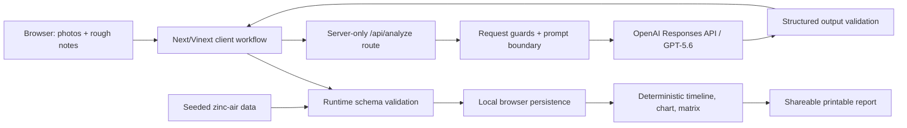

# BenchPilot — Build Week Plan

## Product thesis

Physical experiments usually begin as photos, handwritten readings, and half-remembered setup changes. BenchPilot turns that evidence into a reproducible experimental record, then helps the researcher challenge their own interpretation and choose the next test with the highest information value. The product is explicitly epistemic: reported facts, visual observations, calculations, hypotheses, unknowns, safety notes, and recommendations remain visibly distinct.

The competition demo is optimized around one memorable loop: **Capture → Structure → Challenge → Test → Compare**. A judge can load a complete zinc-air battery investigation with one button, understand the voltage anomaly within seconds, and see the Hypothesis Matrix update when a discriminating measurement is added.

## User story

As an independent inventor, student, maker, or small research team member, I want to combine experiment photos and rough notes into a trustworthy structured record, pressure-test my explanation, and receive a short ranked set of falsifiable follow-up experiments so I can learn faster without overstating what the evidence proves.

Primary judge journey:

1. Open BenchPilot and choose **Load zinc-air demo**.
2. Review the captured apparatus, materials, notes, and two validated voltage timelines.
3. See the evidence separated by provenance and uncertainty.
4. Open **Challenge** to compare no more than three competing mechanisms.
5. Use the Hypothesis Matrix to see which observations discriminate among them.
6. Add the planned separator/rewetting measurement and see support change transparently.
7. Open **Test** for the highest-information, lowest-effort next experiment.
8. Open **Compare** for charted run data and a concise evidence-update summary.
9. Export a clean experiment report.

## Architecture

- **Web stack:** strict TypeScript, React 19, Next.js-compatible App Router on the bundled Vinext/Vite/Cloudflare Sites runtime, Tailwind CSS, and accessible custom components.
- **Domain layer:** Zod schemas are the source of truth for experiment records, challenges, planned tests, comparison notes, and matrix evidence. UI components consume inferred typed data only.
- **AI layer:** a server-only API route uses the official OpenAI JavaScript SDK and the Responses API with image inputs and JSON-schema structured output. Versioned prompts live in a dedicated server module. Notes and images are delimited as untrusted evidence, never instructions.
- **Demo layer:** realistic precomputed zinc-air records use the same validation and derivation path as live results. The no-key experience is the default reliability path.
- **Derived views:** timelines are sorted deterministically, chart points come only from validated measurements, and Hypothesis Matrix cells are computed from explicit evidence links rather than generated ad hoc.
- **Persistence:** contest-version records and UI preferences live in `localStorage`; no database is needed.
- **Report:** a printable/shareable report surface is produced from the same validated record, with provenance and uncertainty labels intact.

## Data model

Core `ExperimentRun` fields:

- `id`, `title`, `objective`, `createdAt`, `status`, `sourceMode`
- `apparatus[]`, `materials[]`
- `independentVariables[]`, `dependentVariables[]`, `controlledVariables[]`
- `measurements[]`: `id`, `name`, `value`, `unit`, `elapsedSeconds`, optional timestamp, method, and provenance
- `reportedObservations[]`: user-confirmed evidence
- `imageObservations[]`: model-described visual evidence with confidence and image reference
- `calculatedResults[]`: formula, inputs, output, and unit
- `uncertainties[]`, `safetyConsiderations[]`, `missingInformation[]`
- `hypotheses[]`: mechanism, for/against evidence, unknowns, confidence, falsifier
- `nextExperiments[]`: changed variable, controls, measurements, per-hypothesis expectations, stop conditions, safety, effort, information value, rank

Supporting types:

- `EvidenceItem` with category and provenance
- `HypothesisAssessment` with stable evidence IDs
- `MatrixObservation` and `MatrixCell` with `supports | contradicts | neutral | unknown`
- `RunComparison` with validated differences and hypothesis support deltas
- `AnalysisEnvelope` with schema/prompt version metadata

## Major risks and mitigations

| Risk                                       | Mitigation                                                                                                                                                 |
| ------------------------------------------ | ---------------------------------------------------------------------------------------------------------------------------------------------------------- |
| Model returns malformed or incomplete data | Strict structured output plus a second runtime parse; invalid output returns a typed error and never reaches UI state.                                     |
| Scientific overclaiming                    | Separate evidence classes visually; use calibrated labels; include falsifiers, unknowns, and safety notes; never present hypotheses as conclusions.        |
| Demo depends on a secret or network        | One-click seeded demo is complete and uses identical typed rendering paths.                                                                                |
| Chart or matrix invents data               | Deterministic utilities operate only on validated measurements and explicit evidence relationships; unit tests cover ordering and construction.            |
| Uploaded content attempts prompt injection | Server prompt marks user material as untrusted experimental evidence; instruction-like text is ignored; only schema-conforming evidence is accepted.       |
| Oversized or unsafe upload                 | Client and server limits, MIME allowlist, image count/size caps, abort behavior, and redacted logs.                                                        |
| Premium UI becomes visually dense          | Progressive disclosure around five workflow stages, strong first viewport, limited hypothesis count, responsive cards, and a consistent provenance legend. |
| Server runtime incompatibility             | Keep the route Web API-compatible and verify a production Vinext build on the bundled Cloudflare Worker target.                                            |

## Milestones

1. **Foundation:** initialize the app, lock domain schemas, seed the zinc-air evidence, and add deterministic derivation tests.
2. **Core demo:** implement the five-stage workflow, demo loader, evidence hierarchy, chart, Hypothesis Matrix, and comparison.
3. **Live analysis:** add guarded upload handling, versioned prompts, OpenAI SDK integration, structured response parsing, abort/error behavior, and a clear demo/live mode status.
4. **Product polish:** local persistence, report/export surface, skeleton/empty/error/success states, motion, mobile layouts, keyboard navigation, and accessibility semantics.
5. **Submission readiness:** finish docs and recording materials, exercise no-key and API error paths, run every quality gate, audit secrets/numbers, and prepare deployment.

## Definition of done

- A judge can load the seeded zinc-air investigation with one prominent action and traverse the full workflow in under two minutes.
- The no-key path is complete, attractive, and deterministic.
- The live API route uses GPT-5.6, image input, server-side prompts, structured output, and runtime validation; the key never enters the client bundle.
- Reported facts, image observations, calculations, hypotheses, unknowns, safety considerations, and recommended tests are visually and semantically distinct.
- The Challenge view contains at most three competing hypotheses with mechanism, evidence for/against, unknowns, confidence, and falsification criteria.
- Ranked next experiments prioritize information value per effort and include all requested controls and stop/safety details.
- Comparison includes two real seeded runs, timeline, data-driven voltage chart, configuration differences, changed variables, and support shifts.
- The Hypothesis Matrix is legible, responsive, keyboard-accessible, and explains the change caused by a newly added measurement.
- Local persistence and print/report export work without a database.
- Empty, loading, success, error, and no-key states are intentional.
- Formatting, lint, strict type checking, unit tests, integration tests, and production build all pass.
- Tests cover schema validation, measurement parsing, timeline ordering, matrix construction, incomplete model output, demo loading, and API errors.
- Mobile and desktop layouts are visually checked; major flows work by keyboard; labels, focus states, contrast, and reduced-motion behavior are present.
- No secrets are committed, no dead controls remain, and every chart number traces to validated structured data.
- README, build log, Devpost copy, demo script/checklist, judge brief, deployment checklist, architecture diagram, screenshot list, `.env.example`, and seeded demo data are complete and truthful.

## Features deliberately excluded

- Authentication, accounts, organizations, permissions, payments, and team collaboration
- Chat/messaging, social feeds, comments, or notifications
- A production database, cloud file storage, or long-term experiment repository
- Automatic scientific claims, autonomous lab control, or safety certification
- Arbitrary spreadsheet import, sensor integrations, hardware drivers, or lab information system integrations
- Large-scale statistical analysis, literature review, or citation management
- Complex multi-page settings and administration
- More than the small, falsifiable set of competing explanations and next experiments needed for the contest workflow
