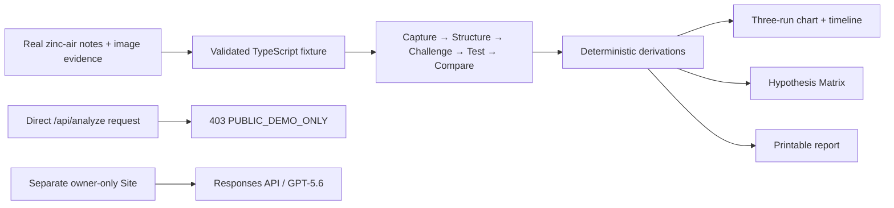

# BenchPilot

**Turn messy physical experiments into reproducible evidence.**

**Public judge demo:** https://benchpilot-build-week.samuraicobra.chatgpt.site

BenchPilot is a multimodal AI lab partner for independent inventors, makers, students, and small research teams. It turns photographs, rough notes, materials, and readings into a typed experimental record, challenges the first interpretation with falsifiable alternatives, ranks the next tests by information gained per unit of effort, and compares runs using only validated measurements.

The public Build Week release is a deterministic replay of previously generated GPT-5.6 analysis. It needs no API key, makes no paid model calls, and routes the typed fixture through the same production schemas and deterministic visualizations. A separate owner-only deployment retains genuine live image-and-notes analysis.

## The problem

Physical experiments rarely begin as clean datasets. Evidence is scattered across photos, readings, incomplete setup notes, and memory. A conventional chatbot can summarize that material, but it can also blur observation with inference, agree too readily, or introduce numerical precision that was never measured.

BenchPilot makes the evidence boundary part of the product. It keeps reported facts, image-derived observations, calculated results, hypotheses, unknowns, safety considerations, and recommended tests distinct from capture through the final report.

## The product

The primary judge journey is **Capture → Structure → Challenge → Test → Compare**:

1. **Capture** photos and natural-language notes with bounded file validation and clear upload states.
2. **Structure** them into a Zod-validated experiment record with provenance, units, timestamps, variables, unknowns, and safety notes.
3. **Challenge** the interpretation with no more than three competing mechanisms, contrary evidence, calibrated confidence, and a falsifier for each.
4. **Test** a ranked experiment queue with exact controls, measurements, expected outcomes, stop conditions, effort, safety, and information value.
5. **Compare** three real run histories on a deterministic timeline and voltage chart derived directly from validated measurements.

The signature Hypothesis Matrix maps observations and planned measurements against each competing explanation. Adding the prepared, explicitly simulated measurement updates the matrix and explains which hypotheses gained or lost support without inserting that value into a real run or chart.

## Why GPT-5.6 is essential

This task needs more than text completion. GPT-5.6 combines image and note evidence, normalizes irregular scientific language into a strict record, surfaces missing controls, generates genuinely competing explanations, and proposes tests that discriminate between them. The server uses the OpenAI Responses API with multimodal image input and Zod-backed structured output. A second runtime validation boundary prevents malformed or incomplete model output from reaching application state.

User notes, filenames, and images are delimited as untrusted experimental evidence, never as system instructions. Prompts are versioned in `server/prompts.ts`, requests use `store: false`, and the API key remains server-only.

## How Codex was used

Codex was the lead engineering workflow for repository inspection, product planning, domain and API design, UI implementation, test authoring, browser QA, accessibility checks, documentation, image generation, and release preparation. Parallel agents handled non-overlapping domain/data, OpenAI integration, and submission-writing streams in the same worktree; the primary agent integrated and validated the result. `CODEX_BUILD_LOG.md` records actual decisions, defects, and verification evidence.

## Architecture



Major areas:

- `lib/domain/`: strict schemas, measurement parsing and ordering, chart/matrix derivations
- `lib/demo/`: the latest real zinc-air run, the validated collapse run, the earlier recovery run, and the precomputed analysis envelope
- `server/`: prompt versions and the guarded OpenAI SDK call
- `app/api/analyze/`: a public hard-disable boundary that rejects GET and POST without importing OpenAI
- `app/`: responsive workflow, evidence surfaces, matrix, chart, report, and local persistence
- `tests/`: schema, parser, timeline, matrix, demo, API, UI, and rendered-build coverage

See `ARCHITECTURE.md` for trust boundaries and sequence diagrams.

## Local setup

Prerequisite: Node.js `>=22.13.0`.

```bash
git clone <repository-url>
cd BenchPilot
npm ci
cp .env.example .env.local   # optional; use Copy-Item on PowerShell
npm run dev
```

Open [http://localhost:3000](http://localhost:3000) and choose **Load zinc-air demo**. No environment variable is required for that path.

## Environment variables

The public release requires no environment variables and ignores OpenAI credentials. `OPENAI_API_KEY` and `OPENAI_MODEL` remain documented only for the preserved private live-analysis deployment; they must never use a `NEXT_PUBLIC_*` prefix.

## Testing

```bash
npm run format:check
npm run lint
npm run typecheck
npm run test:unit
npm run test:integration
npm test
npm run build
```

The test surface covers structured-output validation, incomplete model output, measurement parsing, deterministic timeline ordering, matrix construction and updates, demo loading, request/file limits, upstream and API errors, abort behavior, UI semantics, and rendered production HTML.

## Deployment

This repository targets OpenAI Sites through the bundled Vinext/Vite/Cloudflare runtime. It intentionally declares no D1 or R2 binding because the contest build uses browser persistence.

1. Run `npm ci`, the complete quality-gate commands above, and `npm run build`.
2. Publish the exact release commit to the separate public Sites project.
3. Do not add `OPENAI_API_KEY` or any hosted secret to the public project.
4. Smoke-test the signed-out one-click path, all five stages, the matrix update, three-run chart, report, and direct `/api/analyze` rejection.
5. Keep the existing private live-analysis Site owner-only.

The complete release procedure and rollback checklist are in `DEPLOYMENT_CHECKLIST.md`.

## Limitations

- BenchPilot assists scientific reasoning; it does not prove a mechanism, certify safety, or replace replication and expert review.
- The public fixture references the supplied Scopy screenshot evidence but does not bundle the original prototype photograph; the -0.460 V minimum is explicitly an uncertain transient, not proven reversal.
- Browser persistence is device-local and images are not retained after analysis.
- The three runs have different observation windows and incomplete load/current metadata, so comparison can shift support but cannot establish causality.
- Public visitors cannot perform new live analysis; that paid capability remains isolated in the private owner-only deployment.

## Future direction

The strongest next step is a guided measurement-entry loop: record a real planned result, validate units and instrument context, append it to a run, and recompute hypothesis support with an auditable before/after trail. Later work could add exportable protocol templates and optional shared projects without weakening the provenance boundary.

## Submission materials

- `DEVPOST_SUBMISSION.md`
- `DEMO_SCRIPT_FINAL.md`
- `DEMO_STORYBOARD.md`
- `DEMO_RECORDING_CHECKLIST.md`
- `DEMO_CAPTIONS.srt`
- `RELEASE_QA.md`
- `JUDGE_BRIEF.md`
- `SCREENSHOTS.md`
- `CODEX_BUILD_LOG.md`
- `BUILD_WEEK_PLAN.md`
